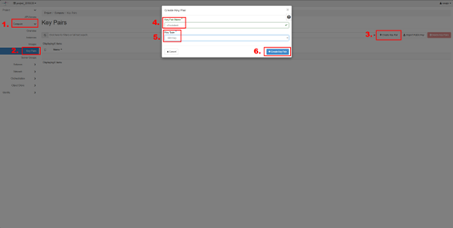
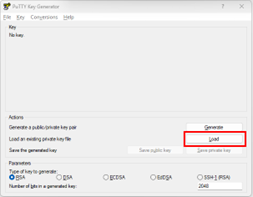
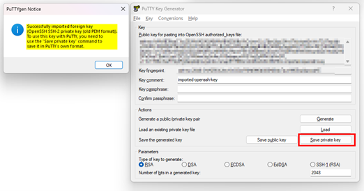
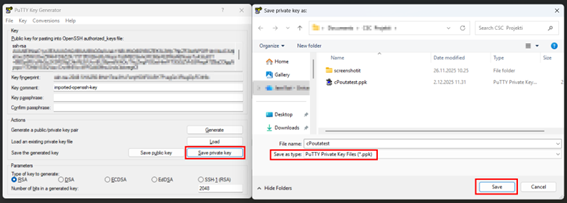
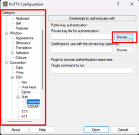
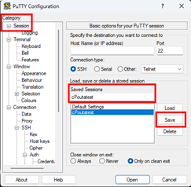
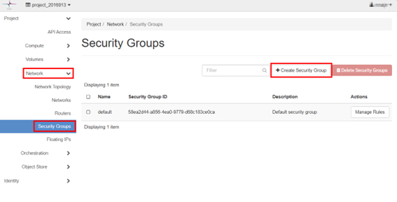
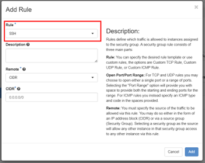

# 4. Creating a Virtual Machine

Before launching a VM, you need to configure:

- SSH keys  
- Security groups (firewall rules)

---

## 4.1 Setting up SSH keys

1. Go to **Compute → Key Pairs**
2. Select **+ Create Key Pair**
3. Enter a name for the key
4. Key Type should be **SSH Key** 
5. Click **+ Create Key Pair**. This will download the key as `.pem` file
    

    
    

**Important:** This is your private key. It cannot be downloaded again.

Keep it secret! Keep it safe!

---

## 4.1.1 PuTTY – converting .pem to .ppk

1. Run **PuTTYgen** and click **Load**
    

    
    

2. Change file filter to **All files (*.*)** and select the key you created (keyname.pem)
    

    
    

3. Set a password to the key. This is not required, but it is advised. Click **Save private key as .ppk**
    

    
    

Now we can use the key in PuTTY to connect to a Virtual Machine.

4. Run **PuTTY** and load the .ppk SSH key. 
5. Go to **Connection → SSH → Auth → Credentials** and under **Private key file for authentication**, use the **Browse** button to select the converted .ppk file.
    

    
    

6. Go to **Session** and under **Saved Sessions** write the name of the new session and click save.
    

    
    

---

## 4.1.2 Firewalls and Security Groups

Security groups in cPouta act as firewall rule sets that control what network traffic is allowed to connect your virtual machine.

### Create a security group

1. Go to **Network → Security Groups** and click **+ Create Security Group**. Name it and write a description.
    

    
    

2. You should automatically be in **Manage Rules** section, if not click **Manage Rules** on the Security Group you just created. Click **+ Add rule**
3. Use the **SSH** rule and click **Add**. With CIDR you can define IP addresses allowed to connect.
    

    
    

### CIDR explanation

- `/32` = only your exact IP address  
- `/24` = your entire local subnet  
- `0.0.0.0/0` = open to the world (not recommended)  
